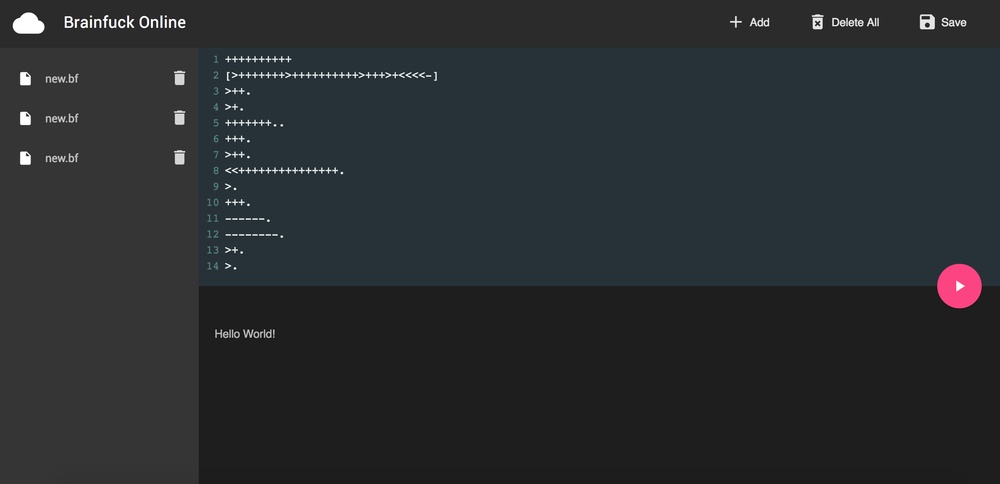

# 🐂 Brainfuck-IDE - a brainfuck online interpreter

This is a brainfuck online interpreter based on React. [中文页面](README-CN.md)

More features are going to be designed and implemented.


# Snapshot



# The brainfuck language

Brainfuck is an esoteric programming language created in 1993 by Urban Müller, and notable for its extreme minimalism.

## Commands

The eight language commands each consist of a single character:

| Character | Meaning                                  |
| --------- | ---------------------------------------- |
| `>`       | increment the [data pointer](https://en.wikipedia.org/wiki/Pointer_(computer_programming)) (to point to the next cell to the right). |
| `<`       | decrement the data pointer (to point to the next cell to the left). |
| `+`       | increment (increase by one) the byte at the data pointer. |
| `-`       | decrement (decrease by one) the byte at the data pointer. |
| `.`       | output the byte at the data pointer.     |
| `,`       | accept one byte of input, storing its value in the byte at the data pointer. |
| `[`       | if the byte at the data pointer is zero, then instead of moving the [instruction pointer](https://en.wikipedia.org/wiki/Program_Counter) forward to the next command, [jump](https://en.wikipedia.org/wiki/Branch_(computer_science)) it *forward* to the command after the *matching* `]` command. |
| `]`       | if the byte at the data pointer is nonzero, then instead of moving the instruction pointer forward to the next command, jump it *back* to the command after the *matching* `[` command. |

## Examples

### Hello World!

The following program prints ["Hello World!"](https://en.wikipedia.org/wiki/Hello_world_program) and a newline to the screen:

```brainfuck
++++++++               Set Cell #0 to 8
[
    >++++               Add 4 to Cell #1; this will always set Cell #1 to 4
    [                   as the cell will be cleared by the loop
        >++             Add 2 to Cell #2
        >+++            Add 3 to Cell #3
        >+++            Add 3 to Cell #4
        >+              Add 1 to Cell #5
        <<<<-           Decrement the loop counter in Cell #1
    ]                   Loop till Cell #1 is zero; number of iterations is 4
    >+                  Add 1 to Cell #2
    >+                  Add 1 to Cell #3
    >-                  Subtract 1 from Cell #4
    >>+                 Add 1 to Cell #6
    [<]                 Move back to the first zero cell you find; this will
                        be Cell #1 which was cleared by the previous loop
    <-                  Decrement the loop Counter in Cell #0
]                       Loop till Cell #0 is zero; number of iterations is 8

>>.                     Cell #2 has value 72 which is 'H'
>---.                   Subtract 3 from Cell #3 to get 101 which is 'e'
+++++++..+++.           Likewise for 'llo' from Cell #3
>>.                     Cell #5 is 32 for the space
<-.                     Subtract 1 from Cell #4 for 87 to give a 'W'
<.                      Cell #3 was set to 'o' from the end of 'Hello'
+++.------.--------.    Cell #3 for 'rl' and 'd'
>>+.                    Add 1 to Cell #5 gives us an exclamation point
>++.                    And finally a newline from Cell #6
```

Reference: [Wikipedia](https://en.wikipedia.org/wiki/Brainfuck)

